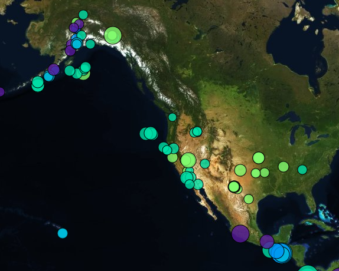

# leaflet-challenge
#### Mapping Earthquakes
---
For this project, I pulled earthquake data from the [USGS](https://earthquake.usgs.gov/earthquakes/feed/v1.0/geojson.php) and mapped it using Leaflet and MapBox. Each earthquake appears at its recorded coordinates on the map, with magnitude denoted by the size of the marker and depth denoted by color.  

